# Customising Unity's Menu Bar


[1 Mastering the basics](#1-mastering-the-basics)

&nbsp;&nbsp;&nbsp;&nbsp;&nbsp;[1.1 Vanilla Menu Item](#11-vanila-menuitem)

&nbsp;&nbsp;&nbsp;&nbsp;&nbsp;[1.2 Nesting](#12-nesting)

&nbsp;&nbsp;&nbsp;&nbsp;&nbsp;[1.3 Trivia: How it works](#13-trivia-how-it-works)

&nbsp;&nbsp;&nbsp;&nbsp;&nbsp;[1.4 Using const for the path](#14-using-const-for-the-path)

&nbsp;&nbsp;&nbsp;&nbsp;&nbsp;[1.5 Ordering](#15-ordering)

&nbsp;&nbsp;&nbsp;&nbsp;&nbsp;[1.6 Divide and conquer](#16-divide-and-conquer)

[2 More advanced usage](#2-more-advanced-usage)

&nbsp;&nbsp;&nbsp;&nbsp;&nbsp;[2.1 Disabled items](#21-disabled-items)

&nbsp;&nbsp;&nbsp;&nbsp;&nbsp;[2.2 Checkmarks/ticks](#22-checkmarksticks)

&nbsp;&nbsp;&nbsp;&nbsp;&nbsp;[2.3 Keyboard shortcuts](#23-keyboard-shortcuts)

## 1. Mastering the basics
### 1.1 Vanila MenuItem

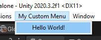

To add a new menu item to Unity's menu bar, you simply need a `static void` method in any class in your project and decorate it with the `MenuItem` attribute. The method must be `static`, but can be `private`. The following example will give you the new menu `My Custom Menu`, with the menu item `Hello World!`. Clicking on this will reveal the classic greating in the console.

```
[MenuItem("My Custom Menu/Hello World!")]
private static void HelloWorld() {
	Debug.Log("Hello World!");
}
```

> Note: Import the UnityEditor namespace to access MenuItem `using UnityEditor`

> Watch Out! The MenuItem Attribute is in the UnityEditor namespace! Make sure you use it in an editor-only script, or ensure this code is wrapped in `#if UNITY_EDITOR` and `#endif`. Otherwise, your builds will fail!

### 1.2 Nesting
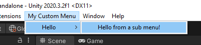

To nest menu items, you can simply add a `/` in the menu path, and it will add another sub menu to you menu!
```
[MenuItem("My Custom Menu/Hello/Hello from a sub menu!")]
private static void HelloWorldNested() {
	Debug.Log("Hello SubMenu World!");
}
```
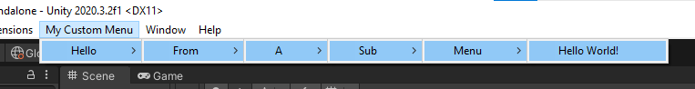

I don't know what the limit is, but I haven't found it yet!

```
[MenuItem("My Custom Menu/Hello/From/A/Sub/Menu/Hello World!")]
private static void HelloWorldNestedManyLevels() {
	Debug.Log("Hello from deep down!");
}
```

### 1.3 Trivia: How it works
When Unity recompiles your scripts, it searches through all the scripts in your project and looks for methods which are decorated with the `MenuItem` attribute. When it finds one, it creates a new menu item with the given path and executes the code in the method when you click that menu item.

### 1.4 Using const for the path
The above examples are great and get us going quickly. However, there is an immediate improvement we can make to make our lives easier going forward: storing the menu path in a `static const` field. This is an improvement because when we get onto more complex menu customisation we will need to repeat this path in multiple places in our code, and we definitely don't want the same string hardcoded several times! The following example has the exact same functionality as the first, but it is better!
```
private const string HelloWorldMenuPath = "My Custom Menu/Hello World!";
```
```
[MenuItem(HelloWorldMenuPath)]
private static void HelloWorld() {
	Debug.Log("Hello World!");
}
```
Anticipating that we will most likely add more than one menu item going forward, we can take our `static const` approach one step further to avoid string repitition - saving you time and errors later on!
```
private const string CustomMenuBasePath = "My Custom Menu/";
private const string HelloWorldMenuPath = CustomMenuBasePath + "Hello World!";
private const string GoodbyeWorldMenuPath = CustomMenuBasePath + "Goodbye World!";
```
```
[MenuItem(HelloWorldMenuPath)]
private static void HelloWorld() {
	Debug.Log("Hello World!");
}

[MenuItem(GoodbyeWorldMenuPath)]
private static void GoodbyeWorld() {
	Debug.Log("Goodbye World!");
}
```

### 1.5 Ordering
Unless you want your menu items to randomly reorder themselves whenever they feel like it, you will definitely want to define an order in your `MenuItem` attributes. Without one, Unity will sometimes rearrange the menu items, which will wreak havok on your muscle menu that will develop when navigating the menu!

You specify the order by using the `priority` field. The menu items will be arranged with the smallest `priority` at the top and the largest `priority` at the bottom.

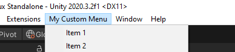

```
[MenuItem(Item1MenuPath, priority = 1)]
private static void Item1() {
    Debug.Log("Item 1!");
}
[MenuItem(Item2MenuPath, priority = 2)]
private static void Item2() {
    Debug.Log("Item 2!");
}
```

### 1.6 Divide and conquer
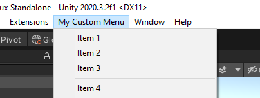

It is possible to add a dividing line, as shown above, by having a gap of more than 10 in their priorities. Note that Item3 has a priority of 3 and Item4 has a priority of 14. This is a gap of 11, which fufills the requirement of more than 10.
```
[MenuItem(Item3MenuPath, priority = 3)]
private static void Item3() {
    Debug.Log("Item 3!");
}

[MenuItem(Item4MenuPath, priority = 14)]
private static void Item4() {
    Debug.Log("Item 4!");
}
```

## 2. More advanced usage
Just when you thought you had mastered `MenuItem`, there's more! You have probably seen in Unity's own menus, and menus of plugins, that you can do much more with menu items. Things like greyed out/disabled menu items, checkmarks/ticks and keyboard shortcuts. You can do these things too if you read on!

### 2.1 Disabled items
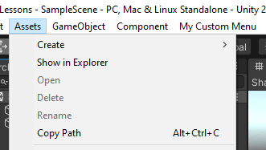

It is very simple to disable the use of a certain menu item, yet the Unity docs are not clear. To disable a menu item, we must make use of what Unity called a Validation Function. A Validation Function is a `static bool` method which gets executed *before* Unity displays your custom menu to you. To make a disabled menu item, simply return false from this method. Conversely, returning true (or not having a Validation Function) will cause the menu item to be enabled.

The confusion comes in by assigning the Validation Function. To do so, you must use the exact same `MenuItem` attribute as before, with the exact same path given as the first parameter. This tells Unity which menu item to apply this Validation Function to. You must then give `true` as the second parameter, which tells Unity that this is a Validation Function.

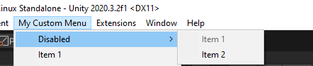

The above is made with the following code. Note how Item1 has a Validation Function assigned which returns false. This will mean Item1 is always disabled. Also note that Item2 has no Validation Function, which acts the same as a Validation Function which returns true, meaning Item2 is always enabled.
```
[MenuItem(Item1MenuPath, priority = 1)]
private static void Item1() {
    Debug.Log("Item 1!");
}

[MenuItem(Item1MenuPath, true)]
private static bool Item1Validate() {
    return false;
}

[MenuItem(Item2MenuPath, priority = 2)]
private static void Item2() {
    Debug.Log("Item 2!");
}
```

You can have some fun with this...
```
[MenuItem(RandomMenuPath, true)]
private static bool RandomItemValidate() {
    return Random.Range(0, 2) == 0;
}
```

### 2.2 Checkmarks/ticks
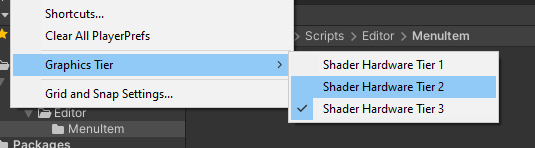

The next feature of menu items is the ability to show a checkmark or a tick next to a menu item. This can be helpful, for example, to indicate if a certain setting is enabled or disabled.

In order to add checkmarks to menu items, we make use of the very same Validation Function from the previous section. As this method is called *before* Unity displays the menu to us, we can make use it to add or remove the checkmark to the menu item.

To add or remove the checkmark, we use the method `Menu.SetChecked`. The first parameter is the path to the menu item. Once again, this is why we store the menu path in the const field because we end up using it so much! The second argument is a `boolean` representing whether we have a checkmark or not.

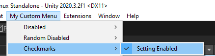

We can achieve a very simply toggling action with the following code.

```
private static bool IsSettingEnabled;
		
[MenuItem(SettingMenuPath, priority = 1)]
private static void Setting() {
    IsSettingEnabled = !IsSettingEnabled;
}

[MenuItem(SettingMenuPath, true)]
private static bool SettingValidate() {
    Menu.SetChecked(SettingMenuPath, IsSettingEnabled);
    return true;
}
```

Once again, you can have some fun with this...
```
[MenuItem(SettingMenuPath, priority = 1)]
private static void Setting() {
}

[MenuItem(SettingMenuPath, true)]
private static bool SettingValidate() {
    Menu.SetChecked(SettingMenuPath, Random.Range(0, 2) == 0);
    return true;
}
```

### BONUS!
If you want the setting to persist between Unity editor sessions (which the above example will not) you can simply modify the above example to use EditorPrefs as shown below. The only modification changing IsSettingEnabled to a property which implements EditorPrefs.

```
private const string SettingPrefKey = "Setting";
private static bool IsSettingEnabled {
    get => EditorPrefs.GetBool(SettingPrefKey);
    set => EditorPrefs.SetBool(SettingPrefKey, value);
}

[MenuItem(SettingMenuPath, priority = 1)]
private static void Setting() {
    IsSettingEnabled = !IsSettingEnabled;
}

[MenuItem(SettingMenuPath, true)]
private static bool SettingValidate() {
    Menu.SetChecked(SettingMenuPath, IsSettingEnabled);
    return true;
}
```


### 2.3 Keyboard shortcuts
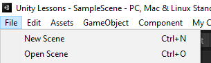

The final topic is assigning keyboard shortcuts to menu items. This is, once again, a simple thing to do, and can save you lots of time for commonly used menu items.

To add a keyboard shortcut to a menu item, you need to suffix a string which specifies the shortcut to the end of the menu item path. You must have a space between your menu item and the shortcut specifier.
```
private const string HelloWorldMenuPath = CustomMenuBasePath + "Hello World! <SHORTCUT_SPECIFIER>";
```

In order to make it as unclear as possible, Unity introduced some some symbols which represent the modifier keys Control/Command, Shift and Alt keys.

|Symbol|Keyboard Key|
|-|-|
|%|Ctrl/Command|
|#|Shift|
|&|Alt|
|_|None|

Combining these modifier keys with any the following key codes gives you a load of options to create keyboard shortcuts.

|Special Key|Keyboard Key|
|-|-|
|A-Z|Letters A-Z|
|LEFT, RIGHT, UP, DOWN|Arrow Keys|
|F1-F12|F1-F12|
|HOME|Home
|END|End
|PGUP|Page Up
|PGDN|Page Down

So, to assign the keyboard shortcut `Ctrl+Shft+I` to a menu item, you simply suffix the string `%#I` to the end of your menu item path. You must have a space between the end of your menu item name and the keyboard shortcut for it to register.

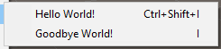

```
private const string HelloWorldMenuPath = CustomMenuBasePath + "Hello World! %#I";
private const string GoodbyeWorldMenuPath = CustomMenuBasePath + "Goodbye World! _I";
```

> Note that to assign a shortcut of a single key on its own, without any modifiers, you must use the underscore `_` symbol.


# FAQ
- Can I dynamically add menu items at runtime?
  - No, unfortunately not - they have to be defined at compile time using `MenuItem`.